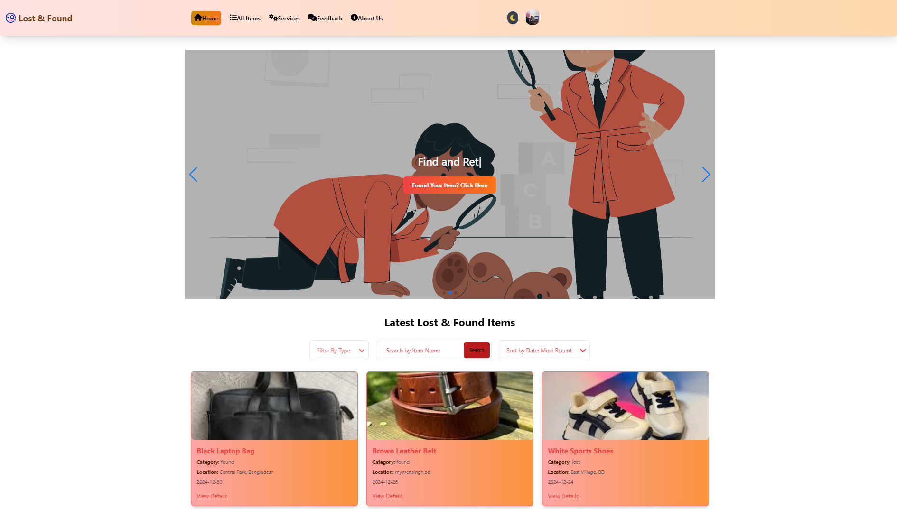

Here’s the **VS Code-friendly version** of your `README.md` file. Just copy and paste this into your `README.md` file in **VS Code** to format it properly.

---

```md
# 🏷️ Find & Lost Items

  

## Overview  
**Find & Lost Items** is a web application designed to help individuals **report and recover lost items**. It provides a platform for users to post lost items, report found items, and initiate recovery actions. The app bridges the gap between those who **lose something valuable** and those who **find it**, encouraging a **community-driven lost & found service**.

## 🌐 Live Demo  
🔗 [Find & Lost Items - Live Site](https://found-lost-items.netlify.app)  

---

## ✨ Key Features  
✅ **Post Lost Items** – Report lost items with descriptions, location, and images.  
✅ **Found Items** – Post found items and mark them for recovery.  
✅ **Item Recovery** – Report recovered items and update their status.  
✅ **User Authentication** – Secure login and account management via Firebase.  
✅ **Item Details Page** – View item details, images, and status (Lost/Found).  
✅ **Responsive Design** – Optimized for mobile and desktop.  
✅ **SweetAlert Notifications** – Real-time user alerts.  

---

## 🛠️ Tech Stack  

### **Frontend:**  
- ⚛️ **React.js** – UI Components  
- 🎨 **Tailwind CSS** – Styling  
- 🔗 **React Router** – Navigation  
- 🔔 **SweetAlert2** – Alerts & Notifications  
- 📅 **React DatePicker** – Date selection  

### **Backend:**  
- 🟢 **Express.js & Node.js** – API Development  
- 🗄️ **MongoDB** – Database  
- 🔒 **Axios** – Secure API Requests  

### **Authentication:**  
- 🔥 **Firebase Authentication** – Secure Login & Registration  

---

## 📦 NPM Packages Used  
- `react` – UI Library  
- `react-router-dom` – Navigation  
- `axios` – API Requests  
- `sweetalert2` – User Alerts  
- `react-datepicker` – Date Picker  
- `tailwindcss` – Styling  
- `firebase` – Authentication  

---

## 🚀 Setup Instructions  

### **1️⃣ Clone the Repository**  
```bash
git clone https://github.com/programming-hero-web-course2/b10a11-client-side-jasminaramim.git
cd b10a11-client-side-jasminaramim
```

### **2️⃣ Install Dependencies**  
```bash
npm install
```

### **3️⃣ Start the Development Server**  
```bash
npm run dev
```

### **4️⃣ Backend Setup (Optional)**  
If you need the backend, set up the server using:  
```bash
git clone https://github.com/your-backend-repo.git
cd your-backend-repo
npm install
npm start
```

---


---

## 📧 Contact  
For any issues, feel free to **open an issue** or contact me at:  
📩 **Email**: jasminaramim2005@gmail.com  

---


---
